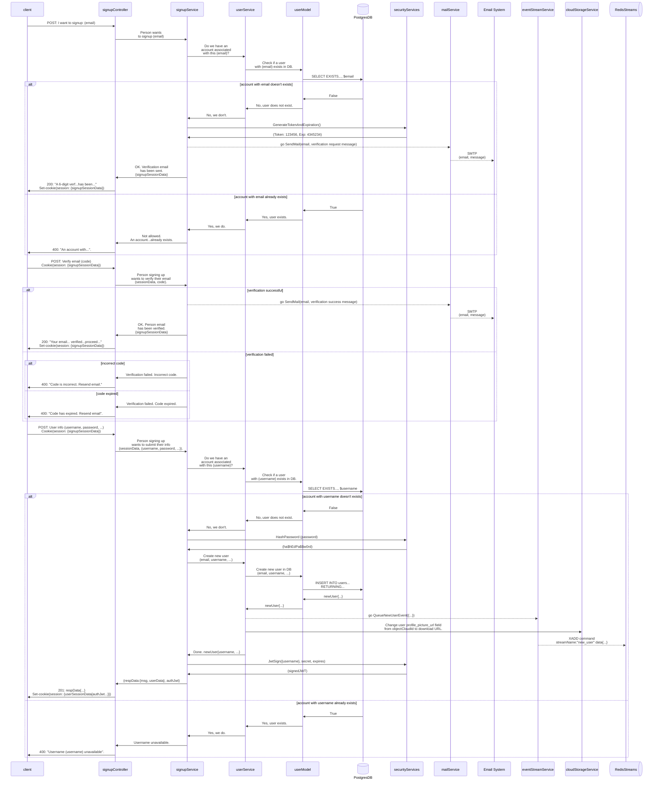
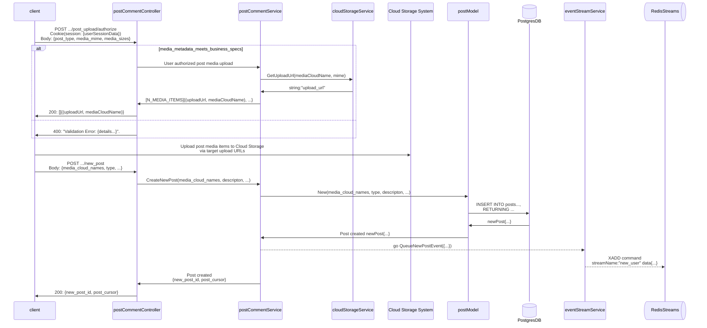

# Sequence Diagrams

## User Signup

```mermaid
sequenceDiagram
  client->>signupController: POST: I want to signup: (email)
  signupController->>signupService: Person wants<br> to signup (email)
  signupService->>userService: Do we have an<br> account associated <br>with this (email)?
  userService->>userModel: Check if a user <br>with (email) exists in DB.
  participant PostgresDB@{ "type": "database" }
  userModel->>PostgresDB: SELECT EXISTS..., $email
  alt account with email doesn't exists
    PostgresDB->>userModel: False
    userModel->>userService: No, user does not exist.
    userService->>signupService: No, we don't.
    signupService->>securityServices: GenerateTokenAndExpiration()
    securityServices->>signupService: (Token: 123456, Exp: 4345234)
    signupService-->>mailService: go SendMail(email, verification request message)
    mailService-->>Email System: SMTP <br>(email, message)
    signupService->>signupController: OK. Verification email <br>has been sent. <br> {signupSessionData}
    signupController->>client: 200: "A 6-digit verf...has been..." <br> Set-cookie(session: {signupSessionData})
  else account with email already exists
    PostgresDB->>userModel: True
    userModel->>userService: Yes, user exists.
    userService->>signupService: Yes, we do.
    signupService->>signupController: Not allowed. <br> An account...already exists.
    signupController->>client: 400: "An account with...".
  end
  
  client->>signupController: POST: Verify email (code) <br>Cookie(session: {signupSessionData})
  signupController->>signupService: Person signing up <br> wants to verify their email <br>(sessionData, code).
  alt verification successful
    signupService-->>mailService: go SendMail(email, verification success message)
    mailService-->>Email System: SMTP <br>(email, message)
    signupService->>signupController: OK. Person email <br>has been verified. <br> {signupSessionData}
    signupController->>client: 200: "Your email... verified...proceed..." <br> Set-cookie(session: {signupSessionData})
  else verification failed
    alt incorrect code
      signupService->>signupController: Verification failed. Incorrect code.
      signupController->>client: 400: "Code is incorrect. Resend email."
    else code expired
      signupService->>signupController: Verification failed. Code expired.
      signupController->>client: 400: "Code has expired. Resend email".
    end
  end

  client->>signupController: POST: User info (username, password, ...) <br>Cookie(session: {signupSessionData})
  signupController->>signupService: Person signing up <br> wants to submit their info <br>(sessionData, (username, password, ...)).
  signupService->>userService: Do we have an<br> account associated <br>with this (username)?
  userService->>userModel: Check if a user <br>with (username) exists in DB.
  userModel->>PostgresDB: SELECT EXISTS..., $username
  alt account with username doesn't exists
    PostgresDB->>userModel: False
    userModel->>userService: No, user does not exist.
    userService->>signupService: No, we don't.
    signupService->>securityServices: HashPassword (password)
    securityServices->>signupService: (ha$hEdPa$$w0rd)
    signupService->>userService: Create new user <br> (email, username, ...)
    userService->>userModel: Create new user in DB <br> (email, username, ...)
    userModel->>PostgresDB: INSERT INTO users...<br>RETURNING...
    PostgresDB->>userModel: newUser{...}
    userModel->>userService: newUser{...}
    userService-->>eventStreamService: go QueueNewUserEvent({...})
    userService->>cloudStorageService: Change user profile_picture_url field <br> from objectCloudId to download URL.
    participant RedisStreams@{ "type": "queue" }
    eventStreamService-->>RedisStreams: XADD command <br> streamName:"new_user" data{...}
    userService->>signupService: Done. newUser{username, ...}
    signupService->>securityServices: JwtSign({username}, secret, expires)
    securityServices->>signupService: (signedJWT)
    signupService->>signupController: (respData:{msg, userData}, authJwt)
    signupController->>client: 201: respData{...} <br> Set-cookie(session: {userSessionData{authJwt...}})
  else account with username already exists
    PostgresDB->>userModel: True
    userModel->>userService: Yes, user exists.
    userService->>signupService: Yes, we do.
    signupService->>signupController: Username unavailable.
    signupController->>client: 400: "Username (username) unavailable".
  end
```

## Post Creation: Client's request path

```mermaid
sequenceDiagram
  client->>postCommentController: POST .../post_upload/authorize <br>Cookie(session: {userSessionData})<br>Body: {post_type, media_mime, media_sizes}
  alt media_metadata_meets_business_specs
    postCommentController->>postCommentService: User authorized post media upload
    postCommentService->>cloudStorageService: GetUploadUrl(mediaCloudName, mime)
    cloudStorageService->>postCommentService: string:"upload_url"
    postCommentService->>postCommentController: [N_MEDIA_ITEMS]{(uploadUrl, mediaCloudName), ...}
    postCommentController->>client: 200: []{(uploadUrl, mediaCloudName)}
  else
    postCommentController->>client: 400: "Validation Error: {details...}".
  end

  client->>Cloud Storage System: Upload post media items to Cloud Storage <br> via target upload URLs

  client->>postCommentController: POST .../new_post <br>Body: {media_cloud_names, type, ...}
  postCommentController->>postCommentService: CreateNewPost(media_cloud_names, descripton, ...)
  postCommentService->>postModel: New(media_cloud_names, type, descripton, ...)
  participant PostgresDB@{ "type": "database" }
  postModel->>PostgresDB: INSERT INTO posts...,<br>RETURNING ...
  PostgresDB->>postModel: newPost{...}
  postModel->>postCommentService: Post created newPost{...}
  postCommentService-->>eventStreamService: go QueueNewPostEvent({...})
  participant RedisStreams@{ "type": "queue" }
  eventStreamService-->>RedisStreams: XADD command <br> streamName:"new_user" data{...}
  postCommentService->>postCommentController: Post created <br>{new_post_id, post_cursor}
  postCommentController->>client: 200: {new_post_id, post_cursor}
```

## Post Creation: `new_post` event background task

